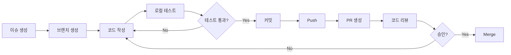

# 기여 가이드 (Contributing Guide)

AI 업무자동화 마켓플레이스 프로젝트에 기여해주셔서 감사합니다! 이 문서는 효과적인 협업을 위한 가이드라인을 제공합니다.

---

## 📋 목차

- [행동 강령](#행동-강령)
- [시작하기](#시작하기)
- [개발 워크플로우](#개발-워크플로우)
- [코드 스타일 가이드](#코드-스타일-가이드)
- [커밋 컨벤션](#커밋-컨벤션)
- [브랜치 전략](#브랜치-전략)
- [Pull Request 프로세스](#pull-request-프로세스)
- [이슈 관리](#이슈-관리)
- [테스트 가이드](#테스트-가이드)
- [바이브코딩 방법론](#바이브코딩-방법론)

---

## 🤝 행동 강령

### 우리의 약속
- 모든 기여자를 존중하고 환영합니다
- 건설적인 피드백을 제공합니다
- 다양한 관점과 경험을 존중합니다
- 커뮤니티의 성장을 돕습니다

### 금지 사항
- 공격적이거나 모욕적인 언어 사용
- 개인적인 공격 또는 비방
- 스팸 또는 광고성 콘텐츠
- 타인의 저작권 침해

---

## 🚀 시작하기

### 1. 개발 환경 설정

#### 필수 요구사항
- Node.js v18.17 이상
- Docker 및 Docker Compose
- Git v2.40 이상

#### 저장소 설정
```bash
# 1. 저장소 포크
# GitHub에서 'Fork' 버튼 클릭

# 2. 로컬에 클론
git clone https://github.com/YOUR_USERNAME/ai-marketplace.git
cd ai-marketplace

# 3. 업스트림 리모트 추가
git remote add upstream https://github.com/original-org/ai-marketplace.git

# 4. 의존성 설치
pnpm install

# 5. 환경 변수 설정
cp .env.example .env.local

# 6. 데이터베이스 설정
docker-compose up -d
npx prisma migrate dev
npx prisma db seed

# 7. 개발 서버 실행
pnpm dev
```

### 2. 개발 도구 설정

#### VSCode 권장 확장
```json
{
  "recommendations": [
    "dbaeumer.vscode-eslint",
    "esbenp.prettier-vscode",
    "bradlc.vscode-tailwindcss",
    "prisma.prisma",
    "ms-azuretools.vscode-docker",
    "firsttris.vscode-jest-runner"
  ]
}
```

#### VSCode 설정 (`.vscode/settings.json`)
```json
{
  "editor.defaultFormatter": "esbenp.prettier-vscode",
  "editor.formatOnSave": true,
  "editor.codeActionsOnSave": {
    "source.fixAll.eslint": true
  },
  "typescript.tsdk": "node_modules/typescript/lib",
  "tailwindCSS.experimental.classRegex": [
    ["cva\\(([^)]*)\\)", "[\"'`]([^\"'`]*).*?[\"'`]"],
    ["cn\\(([^)]*)\\)", "(?:'|\"|`)([^']*)(?:'|\"|`)"]
  ]
}
```

---

## 🔄 개발 워크플로우

### 기본 워크플로우



### 1. 이슈 생성 및 할당
```bash
# 이슈 템플릿 사용
- Feature Request
- Bug Report
- Documentation
- Performance
```

### 2. 브랜치 생성
```bash
# upstream의 최신 변경사항 가져오기
git fetch upstream
git checkout main
git merge upstream/main

# 새 기능 브랜치 생성
git checkout -b feature/user-authentication

# 버그 수정 브랜치 생성
git checkout -b fix/payment-error

# 문서 브랜치 생성
git checkout -b docs/api-documentation
```

### 3. 개발 및 테스트
```bash
# 개발 서버 실행
pnpm dev

# 타입 체크
pnpm type-check

# 린트 검사
pnpm lint

# 테스트 실행
pnpm test

# 모든 검사 실행
pnpm validate
```

### 4. 커밋 및 푸시
```bash
# 변경사항 스테이징
git add .

# 커밋 (컨벤션 준수)
git commit -m "feat: add user authentication"

# 원격 브랜치에 푸시
git push origin feature/user-authentication
```

---

## 📝 코드 스타일 가이드

### TypeScript

#### 타입 정의
```typescript
// ✅ Good: 명시적 타입 정의
interface User {
  id: string;
  email: string;
  role: 'buyer' | 'seller' | 'verifier' | 'admin';
  createdAt: Date;
}

function getUserById(id: string): Promise<User | null> {
  // ...
}

// ❌ Bad: any 타입 사용
function getData(id: any): any {
  // ...
}
```

#### 네이밍 컨벤션
```typescript
// 인터페이스/타입: PascalCase
interface UserProfile { }
type PaymentStatus = 'pending' | 'completed';

// 변수/함수: camelCase
const userName = 'John';
function calculateTotal() { }

// 컴포넌트: PascalCase
function LoginForm() { }

// 상수: UPPER_SNAKE_CASE
const MAX_FILE_SIZE = 100 * 1024 * 1024;

// Private 필드: _ prefix (선택사항)
class UserService {
  private _cache: Map<string, User>;
}
```

### React/Next.js

#### 컴포넌트 구조
```typescript
// ✅ Good: Server Component 우선
// app/products/page.tsx
export default async function ProductsPage() {
  const products = await getProducts();
  return <ProductList products={products} />;
}

// ✅ Good: Client Component 필요 시에만
// components/product-filter.tsx
'use client';

import { useState } from 'react';

export function ProductFilter() {
  const [category, setCategory] = useState('all');
  // ...
}
```

#### Props 타입 정의
```typescript
// ✅ Good: 명시적 Props 인터페이스
interface ProductCardProps {
  product: Product;
  onAddToCart?: (productId: string) => void;
  className?: string;
}

export function ProductCard({
  product,
  onAddToCart,
  className
}: ProductCardProps) {
  // ...
}
```

### CSS/Tailwind

#### 스타일링 우선순위
1. Tailwind 유틸리티 클래스
2. shadcn/ui 컴포넌트
3. CSS Modules (필요 시)
4. 인라인 스타일 (최소화)

```typescript
// ✅ Good: Tailwind + cn 유틸리티
import { cn } from '@/lib/utils';

export function Button({ className, ...props }: ButtonProps) {
  return (
    <button
      className={cn(
        "px-4 py-2 rounded-md bg-primary text-white",
        "hover:bg-primary/90 transition-colors",
        className
      )}
      {...props}
    />
  );
}

// ❌ Bad: 인라인 스타일
<button style={{ padding: '8px 16px', backgroundColor: 'blue' }}>
  Click
</button>
```

### 파일 구조
```typescript
// ✅ Good: 논리적 import 순서
// 1. 외부 라이브러리
import { useState, useEffect } from 'react';
import { useRouter } from 'next/navigation';

// 2. 내부 모듈
import { Button } from '@/components/ui/button';
import { ProductCard } from '@/components/marketplace/product-card';

// 3. 타입
import type { Product } from '@/types/product';

// 4. 유틸리티
import { cn } from '@/lib/utils';
import { formatPrice } from '@/lib/format';

// 5. 스타일
import './styles.css';
```

---

## 💬 커밋 컨벤션

### Conventional Commits 사용
```
<type>(<scope>): <subject>

<body>

<footer>
```

### Type
- `feat`: 새로운 기능 추가
- `fix`: 버그 수정
- `docs`: 문서 변경
- `style`: 코드 포맷팅 (기능 변경 없음)
- `refactor`: 코드 리팩터링
- `perf`: 성능 개선
- `test`: 테스트 추가/수정
- `chore`: 빌드 설정, 패키지 업데이트 등

### 예시
```bash
# 기본 커밋
feat: add user authentication

# 스코프 포함
feat(auth): implement OAuth login

# 본문 및 푸터 포함
feat(payment): integrate Stripe payment

Stripe 결제 시스템 통합
- 일회성 결제 지원
- 구독 결제 지원
- 웹훅 처리 구현

Closes #123
```

### 커밋 메시지 가이드라인
```bash
# ✅ Good
feat: add product search functionality
fix: resolve payment timeout issue
docs: update API documentation

# ❌ Bad
added stuff
fix bug
update
```

---

## 🌳 브랜치 전략

### Git Flow 기반 브랜치 전략

```
main (프로덕션)
  └── develop (개발)
       ├── feature/user-auth (기능)
       ├── feature/payment (기능)
       ├── fix/bug-123 (버그 수정)
       └── release/v1.0.0 (릴리스)
```

### 브랜치 네이밍 컨벤션
```bash
# 기능 개발
feature/product-listing
feature/user-dashboard

# 버그 수정
fix/payment-error
fix/login-redirect

# 핫픽스 (프로덕션 긴급 수정)
hotfix/security-patch

# 릴리스
release/v1.0.0

# 문서
docs/api-guide
docs/architecture

# 성능 개선
perf/image-optimization

# 리팩터링
refactor/auth-module
```

### 브랜치 규칙
- `main`: 항상 배포 가능한 상태 유지
- `develop`: 최신 개발 변경사항
- `feature/*`: develop에서 분기, develop으로 병합
- `hotfix/*`: main에서 분기, main과 develop으로 병합

---

## 🔀 Pull Request 프로세스

### PR 생성 전 체크리스트
- [ ] 로컬에서 모든 테스트 통과
- [ ] 린트 및 타입 체크 통과
- [ ] 커밋 메시지 컨벤션 준수
- [ ] 관련 이슈 번호 포함
- [ ] 변경사항 문서화

### PR 템플릿
```markdown
## 📝 변경 내용
<!-- 무엇을 변경했는지 요약 -->

## 🎯 관련 이슈
Closes #123

## ✅ 체크리스트
- [ ] 테스트 추가/수정
- [ ] 문서 업데이트
- [ ] 타입 체크 통과
- [ ] 린트 검사 통과
- [ ] 로컬에서 빌드 성공

## 📸 스크린샷 (UI 변경 시)
<!-- 스크린샷 첨부 -->

## 🧪 테스트 방법
<!-- 리뷰어가 테스트할 수 있는 방법 -->

## 💡 추가 정보
<!-- 추가 컨텍스트나 고려사항 -->
```

### PR 리뷰 가이드

#### 리뷰어 체크리스트
- [ ] 코드가 요구사항을 충족하는가?
- [ ] 테스트가 충분한가?
- [ ] 성능 이슈가 없는가?
- [ ] 보안 취약점이 없는가?
- [ ] 코드 스타일이 일관적인가?
- [ ] 문서가 업데이트되었는가?

#### 리뷰 코멘트 예시
```markdown
# ✅ 승인
LGTM! (Looks Good To Me)

# 💬 제안
이 부분은 `useMemo`를 사용하면 성능이 개선될 것 같습니다.

# ⚠️ 변경 요청
보안상 이슈가 있습니다. 사용자 입력을 검증해야 합니다.

# ❓ 질문
이 함수는 어떤 경우에 null을 반환하나요?
```

---

## 🐛 이슈 관리

### 이슈 템플릿

#### Feature Request
```markdown
## 📋 기능 설명
<!-- 원하는 기능을 명확히 설명 -->

## 🎯 목적
<!-- 이 기능이 필요한 이유 -->

## 📝 구현 아이디어
<!-- 구현 방법 제안 (선택사항) -->

## ✅ 수용 기준
<!-- 기능이 완성되었다고 판단하는 기준 -->
```

#### Bug Report
```markdown
## 🐛 버그 설명
<!-- 발생한 문제를 명확히 설명 -->

## 🔄 재현 방법
1. '...' 페이지로 이동
2. '...' 버튼 클릭
3. 에러 발생

## 🎯 기대 동작
<!-- 정상 동작 설명 -->

## 📸 스크린샷
<!-- 스크린샷 첨부 -->

## 🌐 환경
- OS: [e.g. macOS 14.0]
- Browser: [e.g. Chrome 120]
- Node.js: [e.g. v20.10.0]
```

### 이슈 라벨
- `bug`: 버그 수정
- `enhancement`: 기능 개선
- `feature`: 새로운 기능
- `documentation`: 문서 작업
- `good first issue`: 초보자 환영
- `help wanted`: 도움 필요
- `priority:high`: 높은 우선순위
- `priority:low`: 낮은 우선순위

---

## 🧪 테스트 가이드

### 테스트 전략

#### 1. 단위 테스트 (Unit Tests)
```typescript
// tests/unit/utils/format-price.test.ts
import { formatPrice } from '@/lib/utils/format-price';

describe('formatPrice', () => {
  it('USD 가격을 올바르게 포맷팅해야 함', () => {
    expect(formatPrice(1000, 'USD')).toBe('$10.00');
  });

  it('KRW 가격을 올바르게 포맷팅해야 함', () => {
    expect(formatPrice(10000, 'KRW')).toBe('₩10,000');
  });

  it('0원도 올바르게 처리해야 함', () => {
    expect(formatPrice(0, 'USD')).toBe('$0.00');
  });
});
```

#### 2. 통합 테스트 (Integration Tests)
```typescript
// tests/integration/api/products.test.ts
import { POST } from '@/app/api/products/route';

describe('POST /api/products', () => {
  it('유효한 상품 데이터로 상품 생성 성공', async () => {
    const request = new Request('http://localhost/api/products', {
      method: 'POST',
      body: JSON.stringify({
        title: 'Test Product',
        price: 1000,
        category: 'n8n',
      }),
    });

    const response = await POST(request);
    expect(response.status).toBe(201);

    const data = await response.json();
    expect(data.product).toBeDefined();
    expect(data.product.title).toBe('Test Product');
  });
});
```

#### 3. E2E 테스트 (End-to-End Tests)
```typescript
// tests/e2e/checkout.spec.ts
import { test, expect } from '@playwright/test';

test('상품 구매 플로우', async ({ page }) => {
  // 로그인
  await page.goto('/login');
  await page.fill('[name="email"]', 'test@example.com');
  await page.fill('[name="password"]', 'password');
  await page.click('[type="submit"]');

  // 상품 선택
  await page.goto('/marketplace');
  await page.click('[data-testid="product-1"]');

  // 장바구니 추가
  await page.click('[data-testid="add-to-cart"]');

  // 결제
  await page.click('[data-testid="checkout"]');
  await expect(page).toHaveURL('/checkout');

  // 결제 완료 확인
  await page.click('[data-testid="complete-payment"]');
  await expect(page.locator('[data-testid="success-message"]')).toBeVisible();
});
```

### 테스트 커버리지 목표
- 단위 테스트: 80% 이상
- 통합 테스트: 주요 API 엔드포인트 100%
- E2E 테스트: 핵심 사용자 플로우 100%

---

## 🤖 바이브코딩 방법론

### 바이브코딩 5원칙

#### 1. 요구사항 먼저
```markdown
❌ Bad: "로그인 기능 만들어줘"

✅ Good:
목표: 이메일/비밀번호 기본 로그인 구현
입력:
  - email: string (유효한 이메일 형식)
  - password: string (8자 이상)
출력:
  - 성공: JWT 토큰 + 사용자 정보
  - 실패: 에러 메시지
제약:
  - Supabase Auth 사용
  - 로그인 실패 시 5회 제한
  - 비밀번호 평문 저장 금지
```

#### 2. 한 번에 1기능
```bash
# ✅ Good: 작은 단위로 개발
1. 기본 로그인 폼 UI
2. 이메일 유효성 검증
3. 비밀번호 유효성 검증
4. API 연동
5. 에러 핸들링

# ❌ Bad: 한 번에 모든 것
"로그인, 회원가입, 비밀번호 찾기, OAuth 전부 구현"
```

#### 3. 즉시 검증
```bash
# 매 단계마다 실행 및 테스트
pnpm dev              # 실행
pnpm type-check       # 타입 체크
pnpm lint             # 린트
pnpm test             # 테스트
```

#### 4. 컨텍스트 관리
```typescript
// ✅ Good: 명확한 타입 및 문서화
/**
 * 사용자 인증 처리
 * @param email - 유효한 이메일 주소
 * @param password - 8자 이상 비밀번호
 * @returns JWT 토큰 및 사용자 정보
 * @throws {AuthError} 인증 실패 시
 */
async function authenticate(
  email: string,
  password: string
): Promise<AuthResult> {
  // ...
}
```

#### 5. 의도적 리팩터링
```typescript
// Step 1: 작동하는 코드 생성
function calculateTotal(items) {
  let total = 0;
  for (let i = 0; i < items.length; i++) {
    total += items[i].price * items[i].quantity;
  }
  return total;
}

// Step 2: 검증 (테스트 통과 확인)

// Step 3: 리팩터링
function calculateTotal(items: CartItem[]): number {
  return items.reduce(
    (total, item) => total + item.price * item.quantity,
    0
  );
}
```

---

## 📞 도움이 필요하신가요?

### 질문하기 전에
1. [README.md](./README.md) 확인
2. [문서](./docs/) 검색
3. [이슈](https://github.com/your-org/ai-marketplace/issues) 검색

### 질문 채널
- **GitHub Discussions**: 일반적인 질문
- **Discord**: 실시간 도움
- **이슈 생성**: 버그 또는 기능 제안

---

## 🎉 기여자 인정

모든 기여자는 프로젝트 README의 기여자 섹션에 추가됩니다.

```bash
# 기여자 목록 자동 생성
npx all-contributors add @username code,doc,test
```

---

**감사합니다! 여러분의 기여가 프로젝트를 더 좋게 만듭니다. 🚀**
