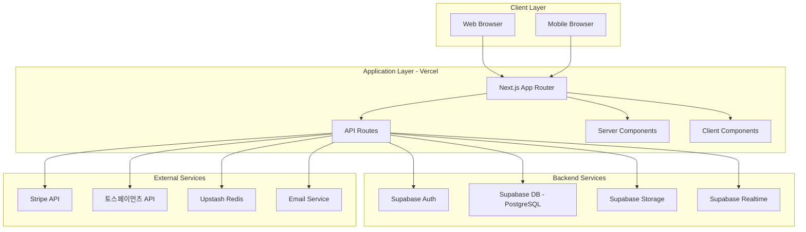
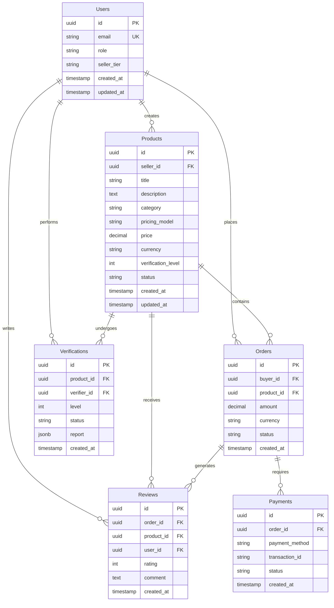
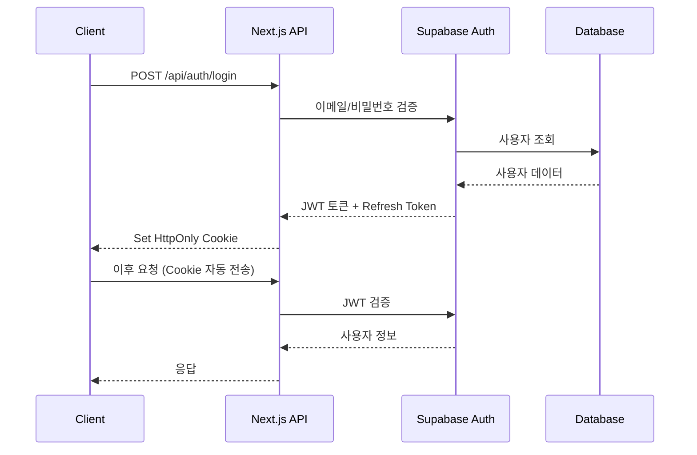
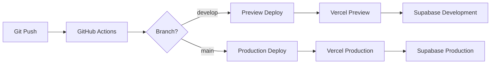

# 시스템 아키텍처 문서

> **버전**: 1.0
> **최종 수정**: 2024-12
> **상태**: Draft

---

## 📋 목차

- [개요](#개요)
- [시스템 아키텍처](#시스템-아키텍처)
- [기술 스택 선정](#기술-스택-선정)
- [데이터 모델](#데이터-모델)
- [API 설계](#api-설계)
- [보안 아키텍처](#보안-아키텍처)
- [성능 최적화](#성능-최적화)
- [배포 아키텍처](#배포-아키텍처)
- [확장성 전략](#확장성-전략)
- [Architecture Decision Records](#architecture-decision-records)

---

## 🎯 개요

### 시스템 목적
AI 업무자동화 솔루션을 안전하게 거래할 수 있는 **신뢰 기반 마켓플레이스 플랫폼**

### 핵심 요구사항
- **신뢰성**: 99.9% 가용성, 전문가 검증 시스템
- **보안**: PCI DSS 준수, 안전한 파일 공유
- **확장성**: 1,000+ 동시 사용자 지원
- **성능**: 페이지 로드 <2s, API 응답 <500ms

### 설계 원칙
1. **서버리스 우선**: Vercel + Supabase로 운영 복잡도 최소화
2. **점진적 향상**: 개발 환경은 단순, 프로덕션은 강력
3. **타입 안전성**: TypeScript 엄격 모드로 런타임 에러 최소화
4. **API 우선**: RESTful API로 향후 모바일 앱 대응
5. **테스트 가능성**: 단위/통합/E2E 테스트 자동화

---

## 🏗️ 시스템 아키텍처

### High-Level Architecture



### Layer Responsibilities

#### 1. Presentation Layer (Frontend)
```
Next.js 14 App Router
├── Server Components (기본)
│   ├── 데이터 페칭
│   ├── SEO 최적화
│   └── 초기 렌더링 성능
└── Client Components (필요 시)
    ├── 인터랙티브 UI
    ├── 상태 관리
    └── 실시간 업데이트
```

**책임**:
- 사용자 인터페이스 렌더링
- 사용자 인터랙션 처리
- 클라이언트 상태 관리
- 폼 검증 및 에러 처리

#### 2. Application Layer (Backend)
```
Next.js API Routes
├── /api/auth/*          # 인증/인가
├── /api/products/*      # 상품 CRUD
├── /api/orders/*        # 주문 처리
├── /api/payments/*      # 결제 처리
├── /api/verifications/* # 검증 시스템
└── /api/webhooks/*      # 외부 이벤트 수신
```

**책임**:
- 비즈니스 로직 실행
- 데이터 검증 (Zod)
- API 응답 생성
- 권한 검증

#### 3. Data Layer
```
Supabase
├── PostgreSQL          # 관계형 데이터
├── Row Level Security  # 데이터 권한 제어
├── Realtime           # 실시간 구독
└── Storage            # 파일 저장
```

**책임**:
- 데이터 영속성
- 트랜잭션 관리
- 실시간 데이터 동기화
- 파일 저장 및 제공

---

## 🔧 기술 스택 선정

### Architecture Decision Records (ADR)

#### ADR-001: Next.js 14 선택
**결정**: Next.js 14 App Router 사용

**이유**:
- ✅ Server Components로 성능 최적화
- ✅ 파일 기반 라우팅으로 개발 속도 향상
- ✅ Vercel 네이티브 통합
- ✅ SEO 최적화 내장
- ✅ API Routes로 백엔드 통합

**대안 고려**:
- Remix: SSR 성능 우수하나 생태계 작음
- SvelteKit: 학습 곡선 높음
- Astro: 정적 사이트에 최적화, 인터랙션 부족

#### ADR-002: Supabase vs. Self-Hosted DB
**결정**: 프로덕션은 Supabase, 개발은 Docker PostgreSQL

**이유**:
- ✅ Supabase: 자동 스케일링, 백업, 모니터링
- ✅ RLS로 보안 강화
- ✅ Auth/Storage 통합
- ✅ 개발 환경: Docker로 로컬 테스트 가능

**트레이드오프**:
- ❌ Vendor Lock-in 리스크
- ✅ 운영 복잡도 대폭 감소
- ✅ 초기 개발 속도 향상

#### ADR-003: Prisma ORM
**결정**: Prisma 사용

**이유**:
- ✅ 타입 안전 쿼리
- ✅ 자동 마이그레이션
- ✅ 직관적인 API
- ✅ PostgreSQL + Supabase 호환

**대안 고려**:
- Drizzle ORM: 성능 우수하나 생태계 작음
- TypeORM: 복잡한 설정
- Raw SQL: 타입 안전성 부족

#### ADR-004: Tailwind CSS + shadcn/ui
**결정**: Tailwind CSS + shadcn/ui 컴포넌트

**이유**:
- ✅ 유틸리티 우선 접근으로 빠른 개발
- ✅ shadcn/ui: 복사 가능한 고품질 컴포넌트
- ✅ 디자인 시스템 일관성
- ✅ 번들 크기 최소화 (사용된 클래스만)

**대안 고려**:
- Chakra UI: 런타임 CSS-in-JS로 성능 저하
- MUI: 번들 크기 큼
- CSS Modules: 스타일링 속도 느림

#### ADR-005: Stripe + 토스페이먼츠
**결정**: 글로벌(Stripe) + 국내(토스페이먼츠) 병행

**이유**:
- ✅ Stripe: 글로벌 표준, 구독 결제 지원
- ✅ 토스: 국내 주요 결제 수단 지원
- ✅ 통합 API로 추상화 가능

---

## 📊 데이터 모델

### Entity Relationship Diagram



### Core Tables

#### Users
```sql
CREATE TABLE users (
  id UUID PRIMARY KEY DEFAULT gen_random_uuid(),
  email VARCHAR(255) UNIQUE NOT NULL,
  role VARCHAR(20) CHECK (role IN ('buyer', 'seller', 'verifier', 'admin')),
  seller_tier VARCHAR(20) CHECK (seller_tier IN ('new', 'verified', 'pro', 'master')),
  profile JSONB,
  created_at TIMESTAMP DEFAULT NOW(),
  updated_at TIMESTAMP DEFAULT NOW()
);

CREATE INDEX idx_users_email ON users(email);
CREATE INDEX idx_users_role ON users(role);
```

#### Products
```sql
CREATE TABLE products (
  id UUID PRIMARY KEY DEFAULT gen_random_uuid(),
  seller_id UUID REFERENCES users(id) ON DELETE CASCADE,
  title VARCHAR(255) NOT NULL,
  description TEXT,
  category VARCHAR(50) CHECK (category IN ('n8n', 'make', 'ai_agent', 'app', 'api', 'prompt')),
  pricing_model VARCHAR(20) CHECK (pricing_model IN ('one_time', 'subscription', 'license')),
  price DECIMAL(10, 2) NOT NULL,
  currency VARCHAR(3) DEFAULT 'USD',
  verification_level INT CHECK (verification_level BETWEEN 0 AND 3) DEFAULT 0,
  status VARCHAR(20) CHECK (status IN ('draft', 'pending', 'active', 'suspended')),
  metadata JSONB,
  created_at TIMESTAMP DEFAULT NOW(),
  updated_at TIMESTAMP DEFAULT NOW()
);

CREATE INDEX idx_products_seller ON products(seller_id);
CREATE INDEX idx_products_category ON products(category);
CREATE INDEX idx_products_status ON products(status);
CREATE INDEX idx_products_verification ON products(verification_level);
```

#### Orders
```sql
CREATE TABLE orders (
  id UUID PRIMARY KEY DEFAULT gen_random_uuid(),
  buyer_id UUID REFERENCES users(id) ON DELETE CASCADE,
  product_id UUID REFERENCES products(id) ON DELETE CASCADE,
  amount DECIMAL(10, 2) NOT NULL,
  currency VARCHAR(3) DEFAULT 'USD',
  status VARCHAR(20) CHECK (status IN ('pending', 'paid', 'completed', 'refunded', 'failed')),
  metadata JSONB,
  created_at TIMESTAMP DEFAULT NOW()
);

CREATE INDEX idx_orders_buyer ON orders(buyer_id);
CREATE INDEX idx_orders_product ON orders(product_id);
CREATE INDEX idx_orders_status ON orders(status);
CREATE INDEX idx_orders_created ON orders(created_at DESC);
```

### Row Level Security (RLS)

#### Products RLS
```sql
-- 읽기: 승인된 상품은 모두, 본인 상품은 상태 무관
CREATE POLICY "Anyone can view active products"
  ON products FOR SELECT
  USING (status = 'active' OR seller_id = auth.uid());

-- 생성: 판매자 역할만
CREATE POLICY "Sellers can create products"
  ON products FOR INSERT
  WITH CHECK (auth.jwt() ->> 'role' IN ('seller', 'admin'));

-- 수정: 본인 상품만
CREATE POLICY "Sellers can update own products"
  ON products FOR UPDATE
  USING (seller_id = auth.uid());

-- 삭제: 본인 상품만
CREATE POLICY "Sellers can delete own products"
  ON products FOR DELETE
  USING (seller_id = auth.uid());
```

#### Orders RLS
```sql
-- 읽기: 구매자 또는 판매자만
CREATE POLICY "Buyers and sellers can view orders"
  ON orders FOR SELECT
  USING (
    buyer_id = auth.uid() OR
    product_id IN (SELECT id FROM products WHERE seller_id = auth.uid())
  );

-- 생성: 인증된 사용자
CREATE POLICY "Authenticated users can create orders"
  ON orders FOR INSERT
  WITH CHECK (buyer_id = auth.uid());
```

---

## 🔌 API 설계

### RESTful API Convention

#### URL 구조
```
/api/{resource}/{id?}/{action?}
```

#### HTTP Methods
- `GET`: 조회
- `POST`: 생성
- `PUT/PATCH`: 수정
- `DELETE`: 삭제

#### Response Format
```typescript
// 성공 응답
{
  "success": true,
  "data": { /* 응답 데이터 */ },
  "meta": {
    "timestamp": "2024-12-27T10:00:00Z",
    "requestId": "req_abc123"
  }
}

// 에러 응답
{
  "success": false,
  "error": {
    "code": "VALIDATION_ERROR",
    "message": "유효하지 않은 이메일 형식입니다",
    "details": { /* 추가 정보 */ }
  },
  "meta": {
    "timestamp": "2024-12-27T10:00:00Z",
    "requestId": "req_abc123"
  }
}
```

### 주요 API Endpoints

#### Authentication
```typescript
POST   /api/auth/signup              // 회원가입
POST   /api/auth/login               // 로그인
POST   /api/auth/logout              // 로그아웃
POST   /api/auth/refresh             // 토큰 갱신
GET    /api/auth/me                  // 현재 사용자
```

#### Products
```typescript
GET    /api/products                 // 상품 목록
GET    /api/products/:id             // 상품 상세
POST   /api/products                 // 상품 생성
PATCH  /api/products/:id             // 상품 수정
DELETE /api/products/:id             // 상품 삭제
GET    /api/products/:id/reviews     // 상품 리뷰
```

#### Orders
```typescript
GET    /api/orders                   // 주문 목록
GET    /api/orders/:id               // 주문 상세
POST   /api/orders                   // 주문 생성
PATCH  /api/orders/:id               // 주문 수정
POST   /api/orders/:id/refund        // 환불 요청
```

#### Payments
```typescript
POST   /api/payments/create-intent   // 결제 준비
POST   /api/payments/confirm          // 결제 확인
POST   /api/webhooks/stripe          // Stripe 웹훅
POST   /api/webhooks/toss            // 토스 웹훅
```

#### Verifications
```typescript
GET    /api/verifications            // 검증 목록
POST   /api/verifications            // 검증 요청
GET    /api/verifications/:id        // 검증 상세
PATCH  /api/verifications/:id        // 검증 업데이트
```

---

## 🔒 보안 아키텍처

### Authentication Flow



### Security Measures

#### 1. Authentication
- **Supabase Auth**: 이메일/비밀번호, OAuth (Google, GitHub)
- **JWT**: Access Token (15분), Refresh Token (7일)
- **HttpOnly Cookie**: XSS 공격 방지

#### 2. Authorization
- **Role-Based Access Control (RBAC)**: buyer, seller, verifier, admin
- **Row Level Security (RLS)**: 데이터베이스 레벨 권한 제어
- **API Middleware**: 엔드포인트별 권한 검증

#### 3. Data Protection
- **Encryption**: HTTPS (TLS 1.3), AES-256 (민감 데이터)
- **Input Validation**: Zod 스키마 검증
- **SQL Injection Prevention**: Prisma Prepared Statements
- **XSS Prevention**: React 자동 이스케이핑 + Content Security Policy

#### 4. File Security
- **Virus Scanning**: ClamAV 또는 VirusTotal API
- **File Type Validation**: MIME type + 확장자 검증
- **Size Limit**: 100MB 제한
- **Signed URLs**: Supabase Storage 시간 제한 URL

#### 5. Payment Security
- **PCI DSS Compliance**: Stripe/토스 API 사용 (카드 정보 직접 저장 안 함)
- **Webhook Verification**: 서명 검증
- **Idempotency Keys**: 중복 결제 방지

---

## ⚡ 성능 최적화

### Frontend Optimization

#### 1. Server Components 우선
```typescript
// ✅ Server Component (기본)
async function ProductList() {
  const products = await getProducts(); // 서버에서 페칭
  return <div>{products.map(p => <ProductCard key={p.id} {...p} />)}</div>;
}

// Client Component (필요 시)
'use client';
function ProductFilter() {
  const [category, setCategory] = useState('all');
  // 인터랙티브 로직
}
```

#### 2. Image Optimization
```typescript
import Image from 'next/image';

<Image
  src="/product.jpg"
  alt="Product"
  width={800}
  height={600}
  loading="lazy"  // 레이지 로딩
  placeholder="blur"  // 블러 플레이스홀더
/>
```

#### 3. Code Splitting
```typescript
// 동적 임포트
const DynamicCheckout = dynamic(() => import('./checkout'), {
  loading: () => <Spinner />,
  ssr: false  // 클라이언트만
});
```

### Backend Optimization

#### 1. Database Indexing
```sql
CREATE INDEX idx_products_composite ON products(status, category, verification_level);
CREATE INDEX idx_orders_buyer_created ON orders(buyer_id, created_at DESC);
```

#### 2. Caching Strategy
```typescript
// Redis 캐싱
import { redis } from '@/lib/redis';

export async function getPopularProducts() {
  const cached = await redis.get('popular_products');
  if (cached) return JSON.parse(cached);

  const products = await prisma.product.findMany({ /* ... */ });
  await redis.setex('popular_products', 3600, JSON.stringify(products));
  return products;
}
```

#### 3. Connection Pooling
```typescript
// Prisma 연결 풀
const globalForPrisma = global as unknown as { prisma: PrismaClient };

export const prisma =
  globalForPrisma.prisma ||
  new PrismaClient({
    log: ['query'],
  });

if (process.env.NODE_ENV !== 'production') globalForPrisma.prisma = prisma;
```

### Performance Targets

| 지표 | 목표 |
|------|------|
| Largest Contentful Paint (LCP) | < 2.5s |
| First Input Delay (FID) | < 100ms |
| Cumulative Layout Shift (CLS) | < 0.1 |
| Time to First Byte (TTFB) | < 800ms |
| API Response Time (p95) | < 500ms |
| Database Query Time (p95) | < 100ms |

---

## 🚀 배포 아키텍처

### Deployment Pipeline



### CI/CD Workflow

#### GitHub Actions
```yaml
name: CI/CD

on:
  push:
    branches: [main, develop]
  pull_request:
    branches: [main, develop]

jobs:
  test:
    runs-on: ubuntu-latest
    steps:
      - uses: actions/checkout@v3
      - uses: actions/setup-node@v3
        with:
          node-version: 20
      - run: pnpm install
      - run: pnpm type-check
      - run: pnpm lint
      - run: pnpm test

  deploy:
    needs: test
    if: github.ref == 'refs/heads/main'
    runs-on: ubuntu-latest
    steps:
      - uses: actions/checkout@v3
      - uses: amondnet/vercel-action@v25
        with:
          vercel-token: ${{ secrets.VERCEL_TOKEN }}
          vercel-args: '--prod'
```

### Environment Separation

| 환경 | 브랜치 | Database | URL |
|------|--------|----------|-----|
| Development | develop | Docker PostgreSQL | localhost:3000 |
| Preview | feature/* | Supabase Dev | *.vercel.app |
| Production | main | Supabase Prod | marketplace.com |

---

## 📈 확장성 전략

### Horizontal Scaling
- **Vercel**: 자동 스케일링 (Edge Functions)
- **Supabase**: Connection Pooler (최대 1,000 연결)
- **Redis**: Upstash 자동 스케일링

### Database Scaling
```sql
-- 읽기 복제본 (Read Replica)
-- Supabase 자동 관리

-- 파티셔닝 (월별)
CREATE TABLE orders_2024_12 PARTITION OF orders
  FOR VALUES FROM ('2024-12-01') TO ('2025-01-01');
```

### Caching Layers
```
Client (Browser Cache)
  ↓
CDN (Vercel Edge)
  ↓
Application Cache (Redis)
  ↓
Database (PostgreSQL)
```

### Monitoring & Observability
- **Vercel Analytics**: 웹 바이탈 모니터링
- **Supabase Logs**: 데이터베이스 쿼리 분석
- **Sentry**: 에러 추적
- **Upstash Monitor**: Redis 성능

---

## 📚 Architecture Decision Records

### ADR Template
```markdown
# ADR-XXX: [제목]

**날짜**: YYYY-MM-DD
**상태**: Draft | Accepted | Deprecated

## 컨텍스트
[문제 상황 및 배경]

## 결정
[선택한 솔루션]

## 이유
- ✅ 장점 1
- ✅ 장점 2

## 결과
[기대 효과 및 트레이드오프]

## 대안
1. [대안 1]: [거부 이유]
2. [대안 2]: [거부 이유]
```

---

**문서 끝**
