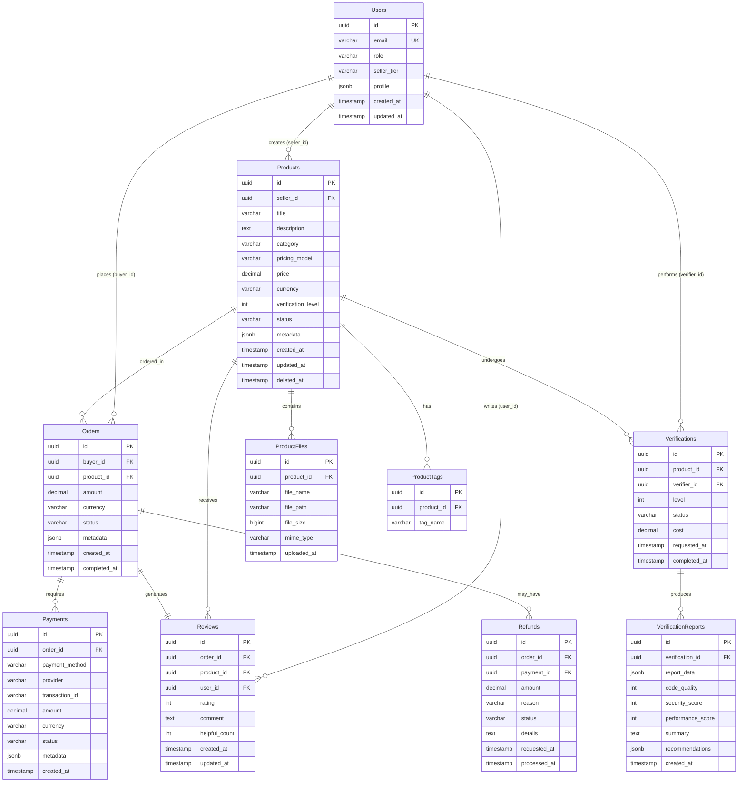

# 데이터베이스 스키마 문서

> **버전**: 1.0
> **최종 수정**: 2024-12
> **DBMS**: PostgreSQL 15+

---

## 📋 목차

- [개요](#개요)
- [ERD (Entity Relationship Diagram)](#erd-entity-relationship-diagram)
- [테이블 상세](#테이블-상세)
- [인덱스 전략](#인덱스-전략)
- [Row Level Security](#row-level-security)
- [마이그레이션 가이드](#마이그레이션-가이드)
- [백업 및 복구](#백업-및-복구)

---

## 🎯 개요

### 데이터베이스 설계 원칙
1. **정규화**: 3NF (Third Normal Form) 준수
2. **타입 안전성**: UUID, ENUM 활용
3. **감사 추적**: created_at, updated_at 모든 테이블 포함
4. **소프트 삭제**: 중요 데이터는 deleted_at 컬럼 활용
5. **JSONB 활용**: 유연한 메타데이터 저장

### 환경별 설정

| 환경 | DBMS | 호스트 | 포트 |
|------|------|--------|------|
| Development | PostgreSQL (Docker) | localhost | 5432 |
| Staging | Supabase | *.supabase.co | 5432 |
| Production | Supabase | *.supabase.co | 5432 |

---

## 🗺️ ERD (Entity Relationship Diagram)



---

## 📊 테이블 상세

### Users (사용자)

사용자 계정 및 역할 관리

```sql
CREATE TABLE users (
  id UUID PRIMARY KEY DEFAULT gen_random_uuid(),
  email VARCHAR(255) UNIQUE NOT NULL,
  password_hash VARCHAR(255), -- NULL for OAuth users
  role VARCHAR(20) NOT NULL CHECK (role IN ('buyer', 'seller', 'verifier', 'admin')),
  seller_tier VARCHAR(20) CHECK (seller_tier IN ('new', 'verified', 'pro', 'master')),
  email_verified BOOLEAN DEFAULT FALSE,
  profile JSONB DEFAULT '{}',
  created_at TIMESTAMP DEFAULT NOW(),
  updated_at TIMESTAMP DEFAULT NOW(),
  last_login_at TIMESTAMP
);

COMMENT ON TABLE users IS '사용자 계정 정보';
COMMENT ON COLUMN users.role IS '사용자 역할: buyer(구매자), seller(판매자), verifier(검증자), admin(관리자)';
COMMENT ON COLUMN users.seller_tier IS '판매자 등급: new(신규), verified(검증), pro(프로), master(마스터)';
COMMENT ON COLUMN users.profile IS 'JSONB: name, bio, avatar_url, social_links, etc.';
```

**Profile JSONB 구조**:
```json
{
  "name": "홍길동",
  "bio": "AI 자동화 전문가",
  "avatar_url": "https://...",
  "company": "AI Corp",
  "website": "https://example.com",
  "social_links": {
    "github": "username",
    "twitter": "username",
    "linkedin": "username"
  },
  "notification_preferences": {
    "email": true,
    "browser": true,
    "marketing": false
  }
}
```

### Products (상품)

마켓플레이스 상품 정보

```sql
CREATE TABLE products (
  id UUID PRIMARY KEY DEFAULT gen_random_uuid(),
  seller_id UUID NOT NULL REFERENCES users(id) ON DELETE CASCADE,
  title VARCHAR(255) NOT NULL,
  slug VARCHAR(255) UNIQUE NOT NULL,
  description TEXT,
  category VARCHAR(50) NOT NULL CHECK (
    category IN ('n8n', 'make', 'ai_agent', 'app', 'api', 'prompt', 'workflow')
  ),
  pricing_model VARCHAR(20) NOT NULL CHECK (
    pricing_model IN ('one_time', 'subscription', 'license', 'free')
  ),
  price DECIMAL(10, 2) NOT NULL,
  currency VARCHAR(3) DEFAULT 'USD',
  verification_level INT CHECK (verification_level BETWEEN 0 AND 3) DEFAULT 0,
  status VARCHAR(20) NOT NULL CHECK (
    status IN ('draft', 'pending', 'active', 'suspended', 'archived')
  ) DEFAULT 'draft',
  thumbnail_url VARCHAR(500),
  demo_url VARCHAR(500),

  -- Stats (Denormalized for performance)
  view_count INT DEFAULT 0,
  purchase_count INT DEFAULT 0,
  rating_avg DECIMAL(3, 2) DEFAULT 0.00,
  review_count INT DEFAULT 0,

  metadata JSONB DEFAULT '{}',
  created_at TIMESTAMP DEFAULT NOW(),
  updated_at TIMESTAMP DEFAULT NOW(),
  published_at TIMESTAMP,
  deleted_at TIMESTAMP
);

COMMENT ON TABLE products IS '마켓플레이스 상품';
COMMENT ON COLUMN products.slug IS 'URL-friendly 고유 식별자 (예: email-automation-n8n)';
COMMENT ON COLUMN products.verification_level IS '검증 레벨: 0(미검증), 1(기본), 2(전문가), 3(보안감사)';
COMMENT ON COLUMN products.metadata IS 'JSONB: tags, features, requirements, changelog, etc.';
```

**Metadata JSONB 구조**:
```json
{
  "features": [
    "Gmail 연동",
    "OpenAI 자동 응답",
    "이메일 필터링"
  ],
  "requirements": {
    "n8n_version": "1.0.0+",
    "api_keys": ["OpenAI", "Gmail"]
  },
  "changelog": [
    {
      "version": "1.1.0",
      "date": "2024-12-01",
      "changes": ["버그 수정", "성능 개선"]
    }
  ],
  "demo_credentials": {
    "username": "demo@example.com",
    "password": "demo123"
  }
}
```

### ProductFiles (상품 파일)

상품에 첨부된 파일 정보

```sql
CREATE TABLE product_files (
  id UUID PRIMARY KEY DEFAULT gen_random_uuid(),
  product_id UUID NOT NULL REFERENCES products(id) ON DELETE CASCADE,
  file_name VARCHAR(255) NOT NULL,
  file_path VARCHAR(500) NOT NULL, -- Supabase Storage path
  file_size BIGINT NOT NULL, -- bytes
  mime_type VARCHAR(100) NOT NULL,
  file_type VARCHAR(20) CHECK (
    file_type IN ('main', 'documentation', 'media', 'other')
  ) DEFAULT 'main',
  download_count INT DEFAULT 0,
  uploaded_at TIMESTAMP DEFAULT NOW()
);

COMMENT ON TABLE product_files IS '상품 첨부 파일';
COMMENT ON COLUMN product_files.file_type IS 'main(주 파일), documentation(문서), media(이미지/영상), other(기타)';
```

### ProductTags (상품 태그)

상품 검색을 위한 태그

```sql
CREATE TABLE product_tags (
  id UUID PRIMARY KEY DEFAULT gen_random_uuid(),
  product_id UUID NOT NULL REFERENCES products(id) ON DELETE CASCADE,
  tag_name VARCHAR(50) NOT NULL,
  created_at TIMESTAMP DEFAULT NOW(),
  UNIQUE(product_id, tag_name)
);

COMMENT ON TABLE product_tags IS '상품 태그 (검색 최적화)';

-- 인덱스
CREATE INDEX idx_product_tags_name ON product_tags(tag_name);
CREATE INDEX idx_product_tags_product ON product_tags(product_id);
```

### Orders (주문)

구매 주문 정보

```sql
CREATE TABLE orders (
  id UUID PRIMARY KEY DEFAULT gen_random_uuid(),
  order_number VARCHAR(50) UNIQUE NOT NULL, -- ORD-20241227-A1B2C3
  buyer_id UUID NOT NULL REFERENCES users(id) ON DELETE CASCADE,
  product_id UUID NOT NULL REFERENCES products(id) ON DELETE RESTRICT,

  amount DECIMAL(10, 2) NOT NULL,
  currency VARCHAR(3) DEFAULT 'USD',

  status VARCHAR(20) NOT NULL CHECK (
    status IN ('pending', 'paid', 'processing', 'completed', 'refunded', 'failed', 'cancelled')
  ) DEFAULT 'pending',

  download_count INT DEFAULT 0,
  download_expires_at TIMESTAMP,

  metadata JSONB DEFAULT '{}',
  created_at TIMESTAMP DEFAULT NOW(),
  completed_at TIMESTAMP
);

COMMENT ON TABLE orders IS '주문 내역';
COMMENT ON COLUMN orders.order_number IS '사용자 친화적 주문 번호';
COMMENT ON COLUMN orders.download_expires_at IS '다운로드 만료일 (예: 구매 후 30일)';
```

### Payments (결제)

결제 트랜잭션 정보

```sql
CREATE TABLE payments (
  id UUID PRIMARY KEY DEFAULT gen_random_uuid(),
  order_id UUID NOT NULL REFERENCES orders(id) ON DELETE CASCADE,

  payment_method VARCHAR(50) NOT NULL CHECK (
    payment_method IN ('card', 'bank_transfer', 'paypal', 'stripe', 'toss')
  ),
  provider VARCHAR(50) NOT NULL, -- stripe, toss, etc.
  transaction_id VARCHAR(255) UNIQUE NOT NULL, -- 결제 프로바이더 ID

  amount DECIMAL(10, 2) NOT NULL,
  currency VARCHAR(3) DEFAULT 'USD',
  fee DECIMAL(10, 2) DEFAULT 0.00, -- 수수료

  status VARCHAR(20) NOT NULL CHECK (
    status IN ('pending', 'processing', 'succeeded', 'failed', 'refunded')
  ) DEFAULT 'pending',

  metadata JSONB DEFAULT '{}',
  created_at TIMESTAMP DEFAULT NOW(),
  succeeded_at TIMESTAMP,
  failed_at TIMESTAMP,
  failure_reason TEXT
);

COMMENT ON TABLE payments IS '결제 트랜잭션';
COMMENT ON COLUMN payments.fee IS '플랫폼 수수료';
```

### Refunds (환불)

환불 요청 및 처리

```sql
CREATE TABLE refunds (
  id UUID PRIMARY KEY DEFAULT gen_random_uuid(),
  order_id UUID NOT NULL REFERENCES orders(id) ON DELETE CASCADE,
  payment_id UUID NOT NULL REFERENCES payments(id) ON DELETE CASCADE,

  amount DECIMAL(10, 2) NOT NULL,
  reason VARCHAR(100) NOT NULL CHECK (
    reason IN ('product_issue', 'not_as_described', 'technical_problem', 'duplicate_purchase', 'other')
  ),
  details TEXT,

  status VARCHAR(20) NOT NULL CHECK (
    status IN ('requested', 'approved', 'rejected', 'processed')
  ) DEFAULT 'requested',

  requested_at TIMESTAMP DEFAULT NOW(),
  processed_at TIMESTAMP,
  processed_by UUID REFERENCES users(id),
  admin_notes TEXT
);

COMMENT ON TABLE refunds IS '환불 요청 및 처리';
```

### Reviews (리뷰)

상품 리뷰 및 평점

```sql
CREATE TABLE reviews (
  id UUID PRIMARY KEY DEFAULT gen_random_uuid(),
  order_id UUID NOT NULL REFERENCES orders(id) ON DELETE CASCADE,
  product_id UUID NOT NULL REFERENCES products(id) ON DELETE CASCADE,
  user_id UUID NOT NULL REFERENCES users(id) ON DELETE CASCADE,

  rating INT NOT NULL CHECK (rating BETWEEN 1 AND 5),
  comment TEXT,
  helpful_count INT DEFAULT 0,

  created_at TIMESTAMP DEFAULT NOW(),
  updated_at TIMESTAMP DEFAULT NOW(),

  UNIQUE(order_id) -- 주문당 1개 리뷰만
);

COMMENT ON TABLE reviews IS '상품 리뷰 및 평점';

-- 트리거: 리뷰 작성 시 상품 평점 업데이트
CREATE OR REPLACE FUNCTION update_product_rating()
RETURNS TRIGGER AS $$
BEGIN
  UPDATE products
  SET
    rating_avg = (SELECT AVG(rating) FROM reviews WHERE product_id = NEW.product_id),
    review_count = (SELECT COUNT(*) FROM reviews WHERE product_id = NEW.product_id)
  WHERE id = NEW.product_id;
  RETURN NEW;
END;
$$ LANGUAGE plpgsql;

CREATE TRIGGER trigger_update_product_rating
AFTER INSERT OR UPDATE OR DELETE ON reviews
FOR EACH ROW EXECUTE FUNCTION update_product_rating();
```

### Verifications (검증)

상품 검증 요청

```sql
CREATE TABLE verifications (
  id UUID PRIMARY KEY DEFAULT gen_random_uuid(),
  product_id UUID NOT NULL REFERENCES products(id) ON DELETE CASCADE,
  verifier_id UUID REFERENCES users(id) ON DELETE SET NULL,

  level INT NOT NULL CHECK (level BETWEEN 1 AND 3),
  cost DECIMAL(10, 2) NOT NULL,

  status VARCHAR(20) NOT NULL CHECK (
    status IN ('requested', 'assigned', 'in_progress', 'completed', 'rejected')
  ) DEFAULT 'requested',

  requested_at TIMESTAMP DEFAULT NOW(),
  assigned_at TIMESTAMP,
  completed_at TIMESTAMP,
  estimated_completion TIMESTAMP
);

COMMENT ON TABLE verifications IS '상품 검증 요청';
COMMENT ON COLUMN verifications.level IS '1(기본), 2(전문가), 3(보안감사)';
```

### VerificationReports (검증 보고서)

검증 결과 보고서

```sql
CREATE TABLE verification_reports (
  id UUID PRIMARY KEY DEFAULT gen_random_uuid(),
  verification_id UUID NOT NULL REFERENCES verifications(id) ON DELETE CASCADE,

  report_data JSONB NOT NULL,

  -- 점수 (0-10)
  code_quality INT CHECK (code_quality BETWEEN 0 AND 10),
  security_score INT CHECK (security_score BETWEEN 0 AND 10),
  performance_score INT CHECK (performance_score BETWEEN 0 AND 10),

  summary TEXT NOT NULL,
  recommendations JSONB,

  created_at TIMESTAMP DEFAULT NOW(),

  UNIQUE(verification_id)
);

COMMENT ON TABLE verification_reports IS '검증 보고서';
```

---

## 🔍 인덱스 전략

### Users 인덱스
```sql
CREATE INDEX idx_users_email ON users(email);
CREATE INDEX idx_users_role ON users(role);
CREATE INDEX idx_users_created ON users(created_at DESC);
```

### Products 인덱스
```sql
-- 복합 인덱스: 상태 + 카테고리 + 검증 레벨
CREATE INDEX idx_products_composite ON products(status, category, verification_level)
  WHERE deleted_at IS NULL;

-- 판매자별 상품
CREATE INDEX idx_products_seller ON products(seller_id)
  WHERE deleted_at IS NULL;

-- 인기 상품 조회
CREATE INDEX idx_products_popular ON products(purchase_count DESC, rating_avg DESC)
  WHERE status = 'active' AND deleted_at IS NULL;

-- 최신 상품
CREATE INDEX idx_products_latest ON products(published_at DESC)
  WHERE status = 'active' AND deleted_at IS NULL;

-- 텍스트 검색 (Full-Text Search)
CREATE INDEX idx_products_search ON products USING GIN(
  to_tsvector('english', title || ' ' || COALESCE(description, ''))
);
```

### Orders 인덱스
```sql
-- 구매자별 주문
CREATE INDEX idx_orders_buyer ON orders(buyer_id, created_at DESC);

-- 판매자별 주문 (상품을 통해)
CREATE INDEX idx_orders_product ON orders(product_id, created_at DESC);

-- 상태별 주문
CREATE INDEX idx_orders_status ON orders(status, created_at DESC);

-- 주문 번호 검색
CREATE INDEX idx_orders_number ON orders(order_number);
```

---

## 🔒 Row Level Security (RLS)

### Products RLS

```sql
-- RLS 활성화
ALTER TABLE products ENABLE ROW LEVEL SECURITY;

-- 읽기 정책: 활성 상품은 모두, 본인 상품은 상태 무관
CREATE POLICY "Anyone can view active products"
  ON products FOR SELECT
  USING (
    (status = 'active' AND deleted_at IS NULL) OR
    seller_id = auth.uid()
  );

-- 생성 정책: 판매자 역할만
CREATE POLICY "Sellers can create products"
  ON products FOR INSERT
  WITH CHECK (
    auth.jwt() ->> 'role' IN ('seller', 'admin') AND
    seller_id = auth.uid()
  );

-- 수정 정책: 본인 상품만
CREATE POLICY "Sellers can update own products"
  ON products FOR UPDATE
  USING (seller_id = auth.uid())
  WITH CHECK (seller_id = auth.uid());

-- 삭제 정책: 본인 상품만 (소프트 삭제)
CREATE POLICY "Sellers can soft delete own products"
  ON products FOR UPDATE
  USING (seller_id = auth.uid() AND deleted_at IS NULL)
  WITH CHECK (deleted_at IS NOT NULL);
```

### Orders RLS

```sql
ALTER TABLE orders ENABLE ROW LEVEL SECURITY;

-- 읽기: 구매자 또는 판매자만
CREATE POLICY "Buyers and sellers can view orders"
  ON orders FOR SELECT
  USING (
    buyer_id = auth.uid() OR
    product_id IN (
      SELECT id FROM products WHERE seller_id = auth.uid()
    )
  );

-- 생성: 인증된 사용자만
CREATE POLICY "Authenticated users can create orders"
  ON orders FOR INSERT
  WITH CHECK (buyer_id = auth.uid());
```

### Reviews RLS

```sql
ALTER TABLE reviews ENABLE ROW LEVEL SECURITY;

-- 읽기: 모두 가능
CREATE POLICY "Anyone can view reviews"
  ON reviews FOR SELECT
  USING (true);

-- 생성: 구매 완료한 사용자만
CREATE POLICY "Buyers can create reviews"
  ON reviews FOR INSERT
  WITH CHECK (
    user_id = auth.uid() AND
    EXISTS (
      SELECT 1 FROM orders
      WHERE id = order_id
        AND buyer_id = auth.uid()
        AND status = 'completed'
    )
  );

-- 수정: 본인 리뷰만
CREATE POLICY "Users can update own reviews"
  ON reviews FOR UPDATE
  USING (user_id = auth.uid())
  WITH CHECK (user_id = auth.uid());
```

---

## 🔄 마이그레이션 가이드

### Prisma 마이그레이션 실행

#### 개발 환경
```bash
# 새 마이그레이션 생성
npx prisma migrate dev --name add_product_tags

# 마이그레이션 상태 확인
npx prisma migrate status

# 리셋 (주의: 데이터 삭제)
npx prisma migrate reset
```

#### 프로덕션 환경
```bash
# 마이그레이션 배포
npx prisma migrate deploy

# Supabase 동기화
npx supabase db push
```

### 수동 마이그레이션 예시

```sql
-- migrations/20241227_add_download_tracking.sql

-- 1. 컬럼 추가
ALTER TABLE product_files
ADD COLUMN download_count INT DEFAULT 0;

-- 2. 인덱스 생성
CREATE INDEX idx_product_files_downloads
ON product_files(download_count DESC);

-- 3. 트리거 생성
CREATE OR REPLACE FUNCTION increment_download_count()
RETURNS TRIGGER AS $$
BEGIN
  UPDATE product_files
  SET download_count = download_count + 1
  WHERE id = NEW.file_id;
  RETURN NEW;
END;
$$ LANGUAGE plpgsql;

-- 4. 롤백 스크립트
-- migrations/20241227_add_download_tracking_rollback.sql
DROP TRIGGER IF EXISTS trigger_increment_download ON downloads;
DROP FUNCTION IF EXISTS increment_download_count();
DROP INDEX IF EXISTS idx_product_files_downloads;
ALTER TABLE product_files DROP COLUMN IF EXISTS download_count;
```

---

## 💾 백업 및 복구

### Supabase 자동 백업
- **Daily Backups**: 매일 자동 백업 (7일 보관)
- **Point-in-Time Recovery**: 2일간 복구 가능

### 수동 백업
```bash
# PostgreSQL Dump
pg_dump -h localhost -U postgres -d ai_marketplace_dev > backup_$(date +%Y%m%d).sql

# 특정 테이블만
pg_dump -h localhost -U postgres -d ai_marketplace_dev -t products > products_backup.sql

# 압축
pg_dump -h localhost -U postgres -d ai_marketplace_dev | gzip > backup_$(date +%Y%m%d).sql.gz
```

### 복구
```bash
# 전체 복구
psql -h localhost -U postgres -d ai_marketplace_dev < backup_20241227.sql

# 압축 파일 복구
gunzip -c backup_20241227.sql.gz | psql -h localhost -U postgres -d ai_marketplace_dev
```

---

## 📈 성능 최적화

### 쿼리 최적화 체크리스트
- [ ] SELECT에서 필요한 컬럼만 선택
- [ ] WHERE 절에 인덱스 활용
- [ ] JOIN은 INNER JOIN 우선
- [ ] LIMIT 사용으로 결과 제한
- [ ] Prepared Statements 사용 (Prisma 자동)

### 모니터링
```sql
-- 느린 쿼리 확인
SELECT query, mean_exec_time, calls
FROM pg_stat_statements
ORDER BY mean_exec_time DESC
LIMIT 10;

-- 테이블 크기
SELECT
  schemaname,
  tablename,
  pg_size_pretty(pg_total_relation_size(schemaname||'.'||tablename)) AS size
FROM pg_tables
WHERE schemaname = 'public'
ORDER BY pg_total_relation_size(schemaname||'.'||tablename) DESC;

-- 인덱스 사용률
SELECT
  schemaname,
  tablename,
  indexname,
  idx_scan,
  idx_tup_read,
  idx_tup_fetch
FROM pg_stat_user_indexes
ORDER BY idx_scan DESC;
```

---

**문서 끝**
